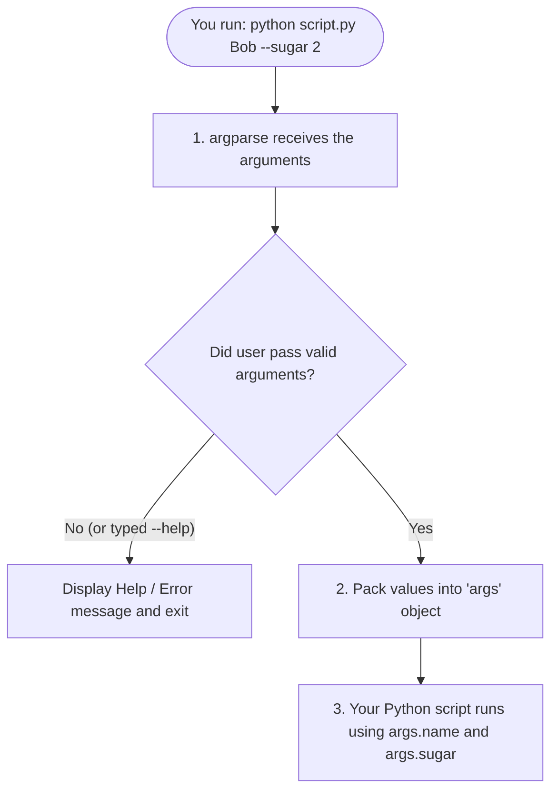
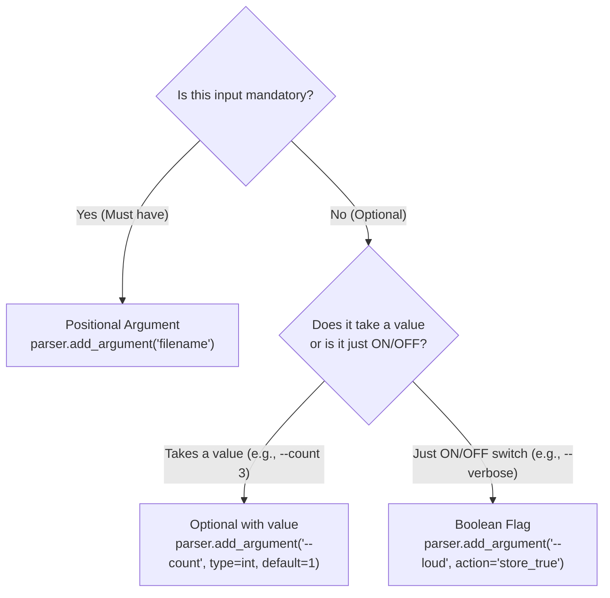

# Python `argparse` for Absolute Beginners
> A quick-reference guide, visual mental model, and beginner vocabulary for command-line arguments.

---

## 1. Absolute Beginner Vocabulary (The Toolbox Analogy)

Before writing any code, here is how the core programming terms connect together:

```text
 🧰 argparse           --> The TOOLKIT (Module)
    │
    └── 📐 ArgumentParser  --> The BLUEPRINT inside the toolkit (Class)
           │
           └── 🔨 parser    --> The TOOL you created to use (Object)
                  │
                  ├── .add_argument()  --> Action/Button on the tool (Method)
                  └── .parse_args()     --> Action/Button to read inputs (Method)
```

| Term | What It Is | Real-World Analogy | In Your Code |
| :--- | :--- | :--- | :--- |
| **Module / Toolkit** | A collection of pre-made code | A physical toolbox | `argparse` |
| **Class** | The blueprint / rules | The drawing of how to build a house | `ArgumentParser` |
| **Object** | The real, living thing created from the blueprint | The actual house built from bricks | `parser` |
| **Method** | An action that an object can perform | The dog barking (`dog.bark()`) | `.add_argument()`, `.parse_args()` |
| **The Dot (`.`)** | "Belongs to" / "Reach inside" | Reaching into the object to press a button | `parser.parse_args()` |
| **Result Object** | The box holding the final answers | The receipt or order slip | `args` |

---

## 2. Line-by-Line Breakdown of the Two Key Lines

### Line A: Creating the Tool
```python
parser = argparse.ArgumentParser(description="Simple tool")
#   ^          ^          ^                       ^
# OBJECT    TOOLKIT     CLASS             OPTIONAL TITLE
```
* **`argparse.`** : Look inside the `argparse` toolkit.
* **`ArgumentParser()`** : Use the `ArgumentParser` blueprint to build a new tool right now.
* **`description="..."`** : An optional title shown when users run `--help`.
* **`parser =`** : Name your new tool `parser` so you can use it.

---

### Line B: Running the Tool
```python
args = parser.parse_args()
#  ^      ^         ^
# RESULT OBJECT   METHOD (DO IT NOW!)
```
* **`parser`** : The object (tool) you created earlier.
* **`.`** : Reach inside `parser`.
* **`parse_args()`** : The method (action) that reads the terminal inputs. The `()` means **"Execute right now!"**
* **`args =`** : Saves all the parsed inputs into a neat result object so you can do `args.name`, `args.sugar`, etc.

---

## 3. The Big Picture: How `argparse` Works

Think of your terminal command as an **order at a drive-thru counter**. `argparse` is the **cashier** who takes your order, checks if it makes sense, and hands a clean order slip to your kitchen (your Python code).



---

## 4. The 4-Step Recipe

Every `argparse` script follows the exact same 4 lines of boilerplate:

```python
import argparse                                # Step 1: Open the toolkit

parser = argparse.ArgumentParser()              # Step 2: Build the tool (Object from Class)
parser.add_argument("name")                     # Step 3: Add a rule (Method)
args = parser.parse_args()                      # Step 4: Run the action (Method)

print(f"Hello, {args.name}!")                   # Step 5: Use the results!
```

---

## 5. Decision Flowchart: Which Argument Type Do I Need?



---

## 6. The 3 Types of Arguments at a Glance

### Type A: Mandatory (Positional)
* **What it is:** Must be provided, order matters, **no dashes**.
* **Python code:**
  ```python
  parser.add_argument("username")
  ```
* **Terminal command:**
  ```bash
  python app.py Alice
  ```
* **Inside Python:** `args.username` will be `'Alice'`.

---

### Type B: Optional with a Value
* **What it is:** Not required; has **two dashes (`--`)** and usually a `default`.
* **Python code:**
  ```python
  parser.add_argument("--sugar", type=int, default=1)
  ```
* **Terminal command:**
  ```bash
  python app.py Alice --sugar 3
  ```
* **Inside Python:** `args.sugar` will be `3` (or `1` if omitted).

---

### Type C: On/Off Switch (Boolean Flag)
* **What it is:** No value passed—just mentioning it flips it to `True`.
* **Python code:**
  ```python
  parser.add_argument("--extra-hot", action="store_true")
  ```
* **Terminal command:**
  ```bash
  python app.py Alice --extra-hot
  ```
* **Inside Python:** `args.extra_hot` will be `True` (or `False` if omitted).

---

## 7. Connecting `argparse` to a Class and Method

When you want CLI arguments to run a custom Python class:

```python
import argparse

# Your Class (Blueprint)
class CoffeeMaker:
    def __init__(self, beans: str, sugar: int = 1):
        self.beans = beans
        self.sugar = sugar

    def brew(self):
        print(f"Brewing {self.beans} coffee with {self.sugar} spoon(s) of sugar!")

# Setup CLI & Call Method
def main():
    parser = argparse.ArgumentParser()
    parser.add_argument("beans", help="Type of coffee beans")
    parser.add_argument("--sugar", type=int, default=1, help="Spoons of sugar")
    
    args = parser.parse_args()

    # 1. Initialize class with args
    machine = CoffeeMaker(beans=args.beans, sugar=args.sugar)
    
    # 2. Call the method
    machine.brew()

if __name__ == "__main__":
    main()
```

---

## 8. Quick Reference Cheat Sheet

| Goal | `add_argument` Code | How to Run in Terminal | Value in Python |
| :--- | :--- | :--- | :--- |
| **Required text** | `parser.add_argument("name")` | `python run.py Bob` | `args.name == "Bob"` |
| **Optional text** | `parser.add_argument("--format", default="json")` | `python run.py --format xml` | `args.format == "xml"` |
| **Number** | `parser.add_argument("--port", type=int, default=8000)` | `python run.py --port 3000` | `args.port == 3000` |
| **Toggle Flag** | `parser.add_argument("--fast", action="store_true")` | `python run.py --fast` | `args.fast == True` |
| **Short + Long flag** | `parser.add_argument("-o", "--output")` | `python run.py -o out.csv` | `args.output == "out.csv"` |
| **Restricted choices** | `parser.add_argument("--color", choices=["red", "blue"])` | `python run.py --color red` | `args.color == "red"` |
| **Show help** | *(automatic, no code needed)* | `python run.py --help` | Displays manual & exits |
